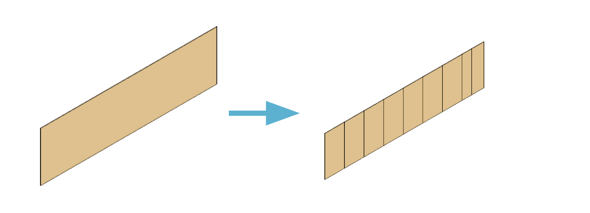

## Table of contents:
- [Introduction](#intro)
- [Technologies](#tech)
- [project Setup](#projo)
- [Illustrations](#illus)
- [Project Information](#info)
- [Contributing](#contri)
- [Acknowledgments](#know)

<INTRODUCTION>

<h1 id="intro">Panelization</h1>




Panelization is a job engineering production process used by [Bamcore](https://www.bamcore.com/) to
splitting Parts (Outer layers of the walls) with laps ( vertical reveals) into Standard Panels of 4’ Width  or less for 
Prime Wall System fabrication.

The project intends to intuitively automate the process (currently done manually ) by:

1. Auto placing reveals
2. Auto panelling
3. Auto placing reveals on Parts without Openings
4. Auto placing reveals on Parts with Openings that do not have horizontal headers
5. Auto placing reveals on Parts with openings and automated horizontal headers
6. Auto placing reveals on Parts with openings and manual horizontal headers


<TECHNOLOGIES>

<h1 id="tech">Technologies</h1>

**Builth With**
- Python
- RevitAPI
- pyRevit
- C#


<PROJECT-SETUP>

<h1 id="projo">Project Setup</h1>


## Hardware Requirements
- You will need a desktop or a laptop computer.
- RAM: A minimum of 4GB RAM is recommended.
- Disk Space: You should have at least 5GB free of space on your working hard drive.

## Software Requirements

**environment**

The project was developed in (windows environment) .

**simple steps to set up on your local machine**

To install the extension on Revit, follow the procedure/instructions below:
- [Installing a pyrevit extension](https://kipkemei.hashnode.dev/installing-a-pyrevit-extension)


To set up a development environment for this project, follow the procedure/instructions below:
- [Setting up a RevitAPI environment](https://kipkemei.hashnode.dev/setting-up-revit-api-development-environment-in-vs-code)


**To interact with the plug-ins and extensions**

- in progress


<PROJECT-INFORMATION>

<h1 id="info">Project Information</h1>

**Project Status**
1. Auto place reveals (complete)
2. Placing reveals on Parts without Openings (complete)
3. Placing reveals on Parts with Openings that do not have horizontal headers (incomplete)
4. Placing reveals on Parts with openings and automated horizontal headers (incomplete)
5. Placing reveals on Parts with openings and manual horizontal headers (incomplete)

**features**
- n/A 
- Auto detect panels that are less than 2'

<CONTRIBUTING>

<h1 id="contri">🤝 Contributing</h1>

Contributions, issues and feature requests are always welcome!
Feel free to check the [issues page](https://github.com/symonkipkemei/panelization/issues).


**How to Contribute**

To get a local copy up and running follow these simple example steps.

```
- Fork the repository
- git clone https://github.com/your_username/panelization
- git checkout develop
- git checkout -b branch name
- git remote add upstream https://github.com/symonkipkemei/panelization
- git pull upstream develop
- git commit -m "commit message"
- git push -u origin HEAD
```


<ACKNOWLEDGMENTS>

<h1 id="know">Acknowledgements</h1>

## Author

👤 **Symon Kipkemei**

- Github: [symonkipkemei](https://github.com/symonkipkemei)
- Twitter: [@symon_kipkemei](https://twitter.com/symon_kipkemei)
- LinkedIn: [Symon kipkemei](https://www.linkedin.com/in/symon-kipkemei/)


## Show your support

Finally, if you've read this far, don't forget to give this repo a ⭐️. 


## Acknowledgments

- [Bamcore team ](https://www.bamcore.com/)
- [codingnomads](https://codingnomads.co/)
- [Erik Fits](https://www.youtube.com/@ErikFrits)
- [E4C](https://www.engineeringforchange.org/)
- [PyChilizer](https://www.youtube.com/@archilizer2946)
- [PyChilizer](https://www.youtube.com/@archilizer2946)
- [The builder coder](https://thebuildingcoder.typepad.com/blog/)
- [Revit Api docs](https://www.revitapidocs.com/)